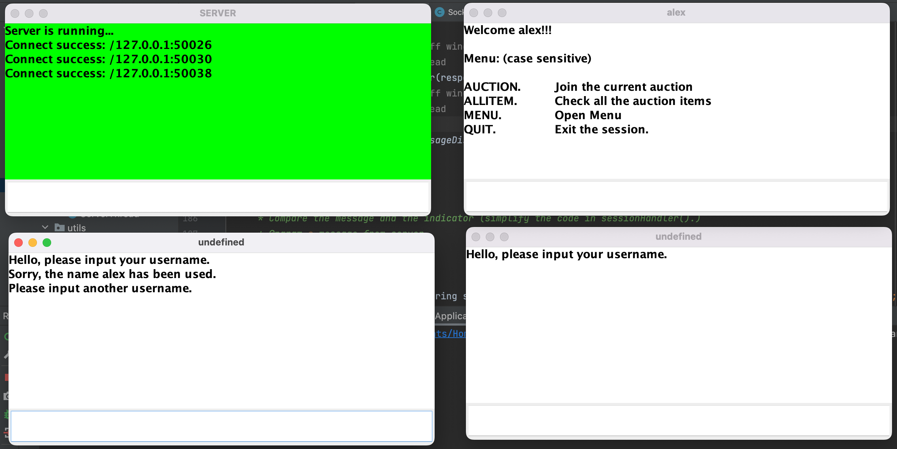
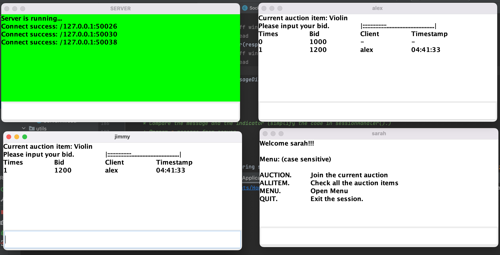
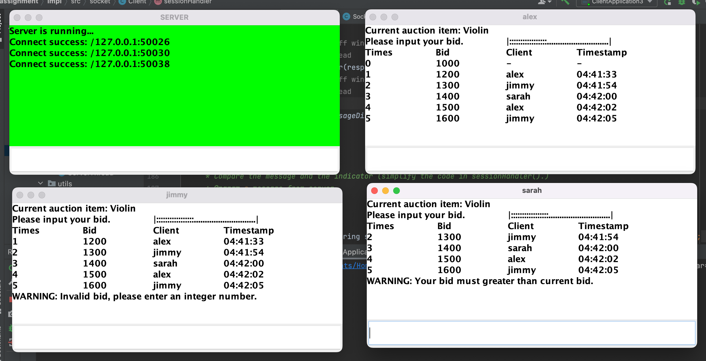
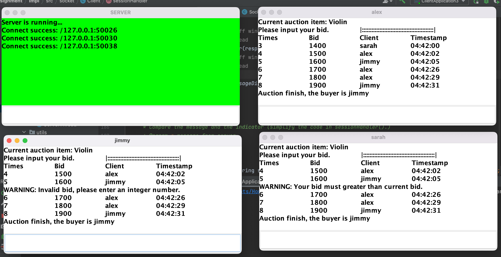
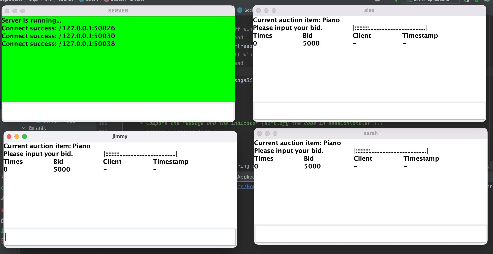
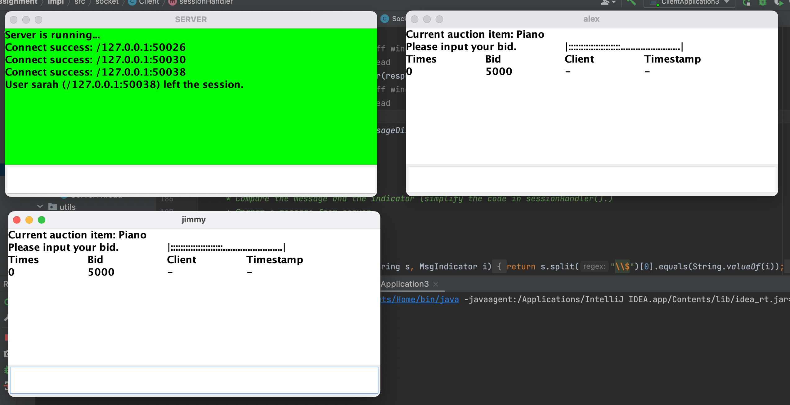
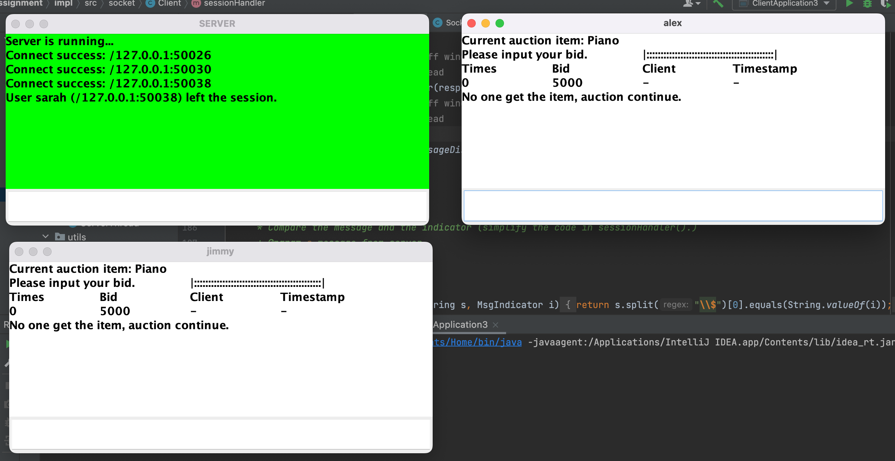
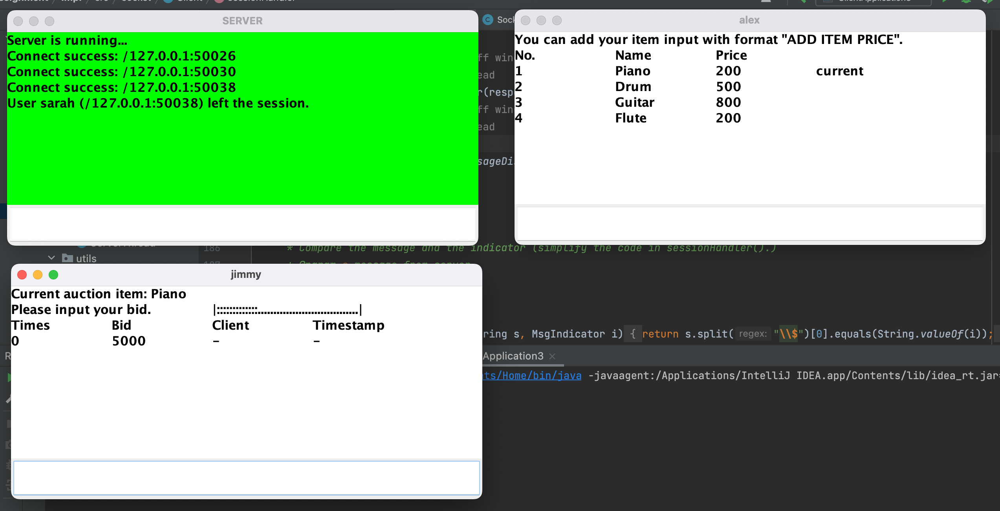
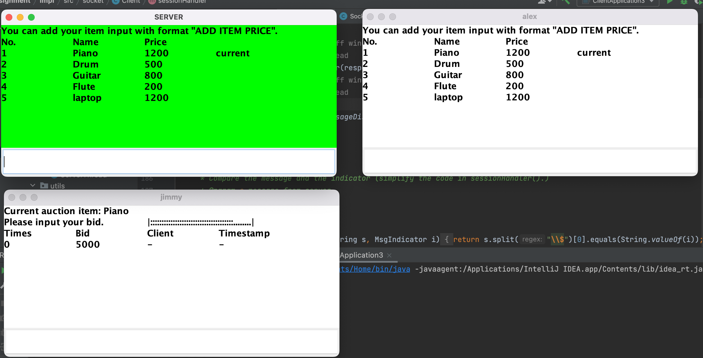

# Distributed Systems Assignment

For this assignment you are required to design and implement a distributed application that is a simulator of an electronic auction system.

There will be multiple clients and a server. The server will offer items for sale. The client module will allow the user to bid for items. An item is sold to the highest bidder. Your code will enable users only to bid for items – it will not conduct actual purchase transactions.

## Client Requirements

The clients should be able to use the all services offered by the auction server.

Clients should:

- Connects to the server. The item currently being offered for sale and the current bid or a (or reserve price) are displayed.
- Enter the bid. The amount entered should be greater than the current highest bid.
- After a new bid is placed, the amount of the new bid must be displayed on the client’s window/console.

## Server Requirements

The server should offer the following services:

- Join auction
- Leave auction
- Bid on an item
- List auction items

The server should:

- Receive connections from multiple clients, i.e. support concurrent multiple clients’ connections.
- After a client connects, notify the client which item is currently on sale and the highest bid (or reserve price).
- Specify the bid period. Max allowed is 45 seconds. When a new bid is raised, the bid period is reset back.
- When a new bid is placed, all clients are notified immediately. Clients should be notified about the time left for bidding (when appropriate).
- If the bid period elapses without a new bid, then the auction for this item closes. The successful bidder (if any) is chosen and all clients are notified.
- When an auction for one item finishes, another item auctioning should start. Minimum of 5 items should be auctioned, one after another.
- Any item not sold should be auctioned again (automatically).

## Extra functionalities

The server should also be able to:

- Allow including new items for sale in the auction server while the auction is running.
- Register clients: unique name will suffice.

## Implementation

The assignment must be implemented using Java sockets. Java multithreading, locks and monitors should be used where necessary. Basic Java JDK should be used. It should work with Java versions 8, 11 or 18 (as installed in Labs). No additional libraries/packages should be used. If data storage is necessary, files should be used.

# Demo Screenshots

